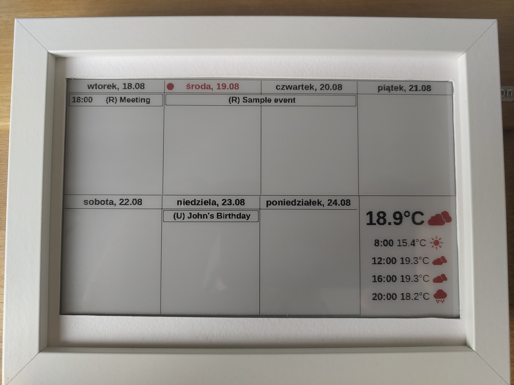

# e-paper server
Server for [e-paper client](https://github.com/bladeours/e-paper-client).  

## Table of Contents
* [General Info](#general-info)
* [How it works](#how-it-works)
* [Example](#example)
* [Technologies Used](#technologies-used)
* [Setup](#setup)
* [Config](#config)

## General Info
I've created this app for my project that uses Raspberry pico and [Waveshare e-ink screen](https://www.waveshare.com/wiki/7.5inch_e-Paper_HAT_(B)_Manual).
It allows me to display calendar (or any other image actually) from [e-paper server](https://github.com/bladeours/e-paper-server)
and I can have an e-ink display in photo frame from IKEA that shows me all of my events.

## How it works
1. When you call on `/calendar` endpoint app is getting event data from .ics files from links in `application.conf` file.
2. Adds those events to HTML file.
3. Gets weather data and adds it to HTML file.
4. Creates a static web page with calendar.
5. Takes screenshot of this calendar.
6. Translate it to bytes and return it as response to query.

## Example


## Technologies Used
* Scala
* Play Framework
* Playwright

## Setup
you can create a Docker Image using sbt command `sbt docker:publishLocal`
or fork project and use workflow to do a hard work. You only need to add DOCKERHUB_USERNAME and DOCKERHUB_TOKEN
to GitHub secrets, and it will create an image and push it to docker hub.

## Config
This app needs `conf/application.conf` file:
```
play.server.http.address = "0.0.0.0"
play.server.http.port = 9000

calendars = [
    {
        url = "<sample_url>",
        tag = "<sample_tag>"
    },
]

lat = "00.00"
long = "00.00"
counterStart="1990-03-01"
counterEnd="1990-03-15"
play.http.secret.key="changeme"
play.http.secret.key=${?APPLICATION_SECRET}
```